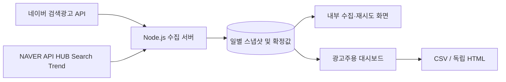

# 네이버 키워드 트렌드 자동화 대시보드

네이버 검색광고 API의 최근 30일 월간검색수와 NAVER API HUB Search Trend의 일별 상대지수를 결합해 키워드별 일일 예상 쿼리를 산정하고 누적하는 로컬 웹 대시보드입니다.

광고주 전달용 리포트와 내부 수집·재시도 화면을 분리했습니다. 완료된 과거 결과는 고정하며, API 실패 건만 안전하게 다시 처리합니다.

## 주요 기능

- PC와 모바일 월간검색수를 합산해 기준 검색량 산출
- 기기 구분 없는 DataLab 일별 지수로 최근 30일 검색량 배분
- 브랜드·비브랜드 키워드 일괄 처리
- 완료된 전일 데이터만 확정하고 이전 날짜 결과는 유지
- API 원본 스냅샷과 작업 성공·실패 이력 저장
- 실패 건 재시도 및 지정 기간 백필
- 일별·주별·월별 누적 대시보드
- 월별 CSV와 광고주 전달용 독립 HTML 다운로드
- 전달용 HTML에서는 내부 운영 버튼 자동 제거

## 계산 방식

```text
일별 예상 쿼리
= (검색광고 PC 월간검색수 + 모바일 월간검색수)
  × 해당 일 DataLab 지수
  ÷ 최근 30일 DataLab 지수 합계
```

검색광고 월간검색수는 매일 한 날짜씩 이동하는 최근 30일 값입니다. 따라서 실행일마다 API 원본을 스냅샷으로 저장하고, 계산이 끝난 날짜는 `FINAL` 상태로 고정합니다.

## 데이터 흐름



## 화면 구성

- `/` — 광고주용 리포트. 일별·주별·월별 분석 및 다운로드
- `/dashboard.html` — 내부 수집, 실패 재시도, 작업 이력 확인

## 실행 방법

요구 사항: Node.js 18 이상

```powershell
Copy-Item .env.example .env
npm start
```

`.env`에 인증정보를 입력한 뒤 [http://localhost:3000](http://localhost:3000)을 엽니다.

```dotenv
NAVER_AD_API_KEY=검색광고_API_KEY
NAVER_AD_SECRET_KEY=검색광고_SECRET_KEY
NAVER_AD_CUSTOMER_ID=검색광고_CUSTOMER_ID
NAVER_API_HUB_CLIENT_ID=API_HUB_CLIENT_ID
NAVER_API_HUB_CLIENT_SECRET=API_HUB_CLIENT_SECRET
PORT=3000
```

완료된 전일 데이터를 명령행에서 수집하려면 다음을 실행합니다.

```powershell
npm run daily
```

이미 `FINAL`인 날짜·키워드는 자동으로 건너뜁니다. Windows 작업 스케줄러 등에 `npm run daily`를 등록하면 매일 누적할 수 있습니다.

## API 확인

연결 설정 상태:

```text
GET /api/status
```

검색광고 API 단독 확인:

```powershell
Invoke-RestMethod -Method Post -Uri http://localhost:3000/api/test/searchad -ContentType 'application/json' -Body '{"keyword":"자동차보험"}'
```

DataLab API 단독 확인:

```powershell
Invoke-RestMethod -Method Post -Uri http://localhost:3000/api/test/datalab -ContentType 'application/json' -Body '{"keyword":"자동차보험"}'
```

## 저장소 공개 시 주의사항

- 실제 인증정보가 들어 있는 `.env`는 Git에서 제외됩니다.
- 실제 운영 이력인 `data/store.json`과 자동 백업 파일도 공개 저장소에서 제외됩니다.
- 최초 실행 시 빈 `data/store.json`이 자동 생성됩니다.
- 포트폴리오에는 고객사명, 실제 API 응답, 운영 검색량 등 비공개 자료를 올리지 않는 것을 권장합니다.

## 기술 구성

- Node.js 내장 HTTP 서버
- Naver Search Ad API
- NAVER API HUB Search Trend API
- Vanilla HTML, CSS, JavaScript
- 파일 기반 JSON 영속 저장소
